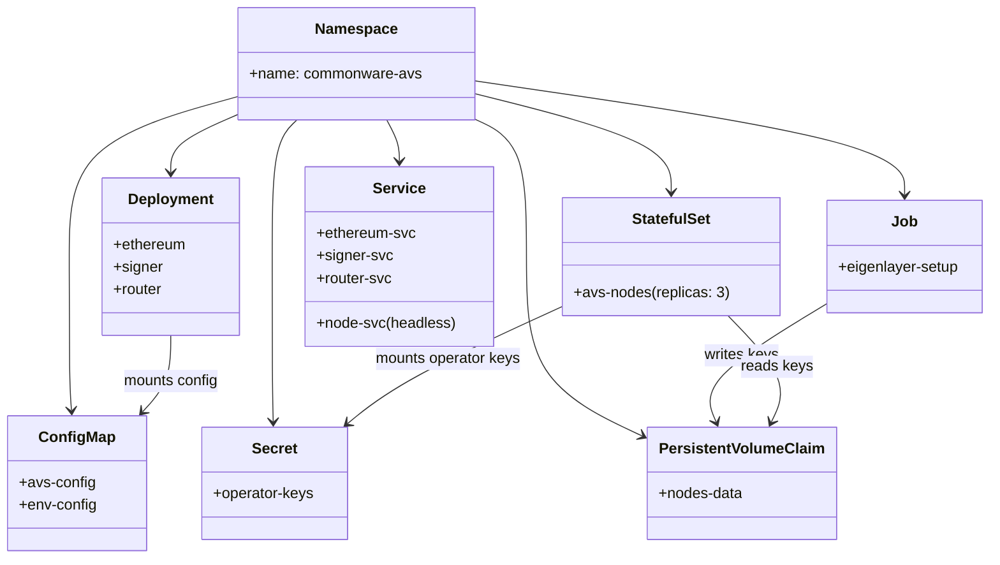
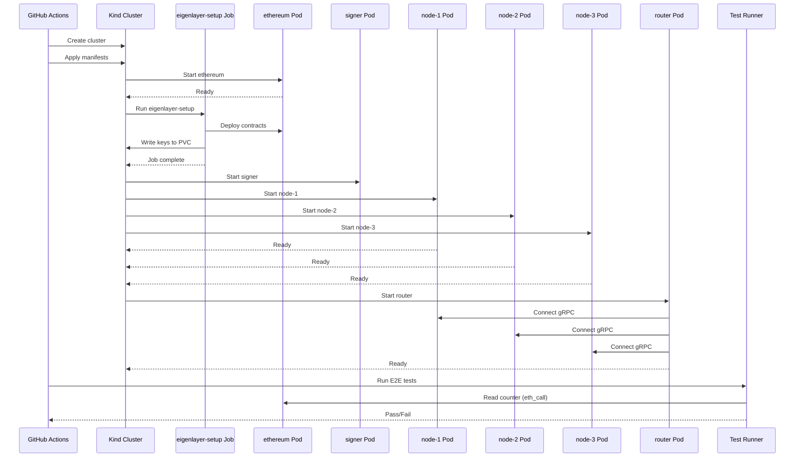
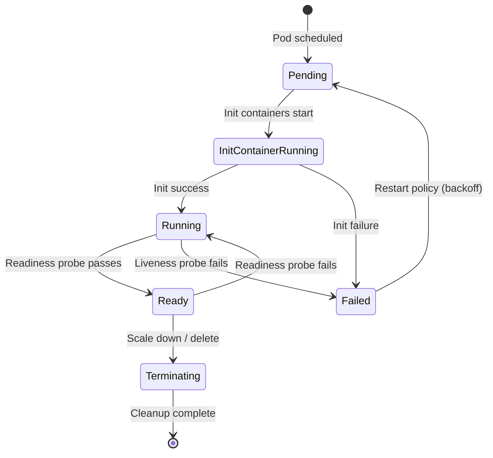

# Docker to Kubernetes Refactor Spec

## 1. Background

### Problem Statement
The current deployment infrastructure relies on Docker Compose for local development, testing, and CI/CD E2E tests. While functional, Docker Compose has limitations for production readiness, scalability, and operational workflows. Moving to Kubernetes provides:
- Better alignment with production deployment patterns
- Native support for rolling updates, health checks, and self-healing
- Improved resource management and scaling capabilities
- Standard tooling for monitoring, logging, and debugging
- Consistent deployment model across environments

### Context / History
- Current setup: 6 Docker Compose services (ethereum, eigenlayer, signer, node-1, node-2, node-3, router)
- CI/CD pipelines: `integration-test.yml` and `local-integration-test.yml` for E2E testing
- Multi-architecture Docker images already published to GHCR
- EigenLayer setup container runs as an init-style job (generates keys, deploys contracts)

### Stakeholders
- Development team (local development workflows)
- DevOps/SRE (production deployment and operations)
- CI/CD systems (automated testing)

## 2. Motivation

### Goals & Success Criteria
1. **Production-ready infrastructure**: K8s manifests suitable for staging/production deployment
2. **Preserved E2E test coverage**: All existing CI tests must continue to pass
3. **Local development support**: Easy local K8s setup using kind/minikube
4. **Simplified operations**: Leverage K8s primitives for health checks, restarts, and scaling

### Success Metrics
- All existing E2E tests pass in the K8s environment
- Counter increment test completes successfully
- Fast aggregation test passes (dev branch)
- Ingress endpoint test passes (dev branch)
- Local development setup documented and functional

## 3. Scope and Approaches

### In Scope
| Technical Functionality | Value | Trade-offs |
|------------------------|-------|------------|
| Kubernetes manifests for all services | Production-ready deployment | Additional complexity for simple setups |
| Helm chart for parameterization | Configurable deployments | Learning curve for Helm |
| CI/CD workflow updates | K8s-native E2E testing | More CI setup time |
| ConfigMaps and Secrets | Proper config management | Migration from .env files |
| Init containers for EigenLayer | Proper job sequencing | Init container complexity |

### Non-Goals / Out of Scope
| Technical Functionality | Reasoning | Trade-offs |
|------------------------|-----------|------------|
| Multi-cluster deployment | Not needed for current scale | Could add later |
| Service mesh (Istio/Linkerd) | Over-engineering for current needs | Future consideration |
| Custom operators | Kubernetes primitives sufficient | Maintenance overhead |
| GitOps setup (ArgoCD/Flux) | Can be added independently | Team preference |

### Alternative Approaches
| Approach | Pros | Cons |
|----------|------|------|
| Raw K8s manifests | Simple, no additional tooling | Duplication, harder parameterization |
| Helm charts | Parameterization, templating | Additional dependency |
| Kustomize | K8s-native, overlay support | Less powerful templating |
| **Selected: Kustomize + raw manifests** | Best balance of simplicity and flexibility | Limited templating compared to Helm |

## 4. Step-by-Step Flow

### 4.1 Main ("Happy") Path - CI E2E Test Flow

**Pre-condition**: PR opened or push to main/dev/staging

1. **GitHub Actions** triggers `k8s-integration-test.yml` workflow
2. **System** provisions kind cluster on runner
3. **System** loads locally-built images into kind
4. **System** applies K8s manifests via `kubectl apply -k`
5. **Init Job (eigenlayer-setup)** runs:
   - Deploys EigenLayer contracts
   - Generates BLS operator keys
   - Creates AVS deployment artifacts
   - Writes to shared PersistentVolume
6. **System** waits for Job completion (timeout: 300s)
7. **Signer Pod** starts (depends on eigenlayer-setup Job)
8. **Node Pods (1-3)** start (depend on eigenlayer-setup Job)
9. **Router Pod** starts (depends on nodes being ready)
10. **Test runner** executes counter increment verification
11. **System** cleans up cluster

**Post-condition**: Test passes, PR check shows green

### 4.2 Alternate / Error Paths

| # | Condition | System Action | Handling |
|---|-----------|---------------|----------|
| A1 | eigenlayer-setup timeout | Job exceeds 300s | Collect logs, fail CI |
| A2 | Node fails to connect to ethereum | CrashLoopBackOff | Readiness probe fails, restart |
| A3 | Router can't reach nodes | Connection refused | Liveness probe fails, restart |
| A4 | Counter increment fails | Test assertion fails | Collect all logs, fail CI |
| A5 | Kind cluster creation fails | Docker socket issue | Retry or fail with diagnostics |

## 5. Architecture Diagrams

### 5.1 Kubernetes Resource Hierarchy



### 5.2 Service Communication Flow



### 5.3 Pod Lifecycle State Machine



## 6. Kubernetes Manifest Structure

### 6.1 Directory Layout

```
k8s/
├── base/
│   ├── kustomization.yaml
│   ├── namespace.yaml
│   ├── configmap.yaml
│   ├── pvc.yaml
│   ├── ethereum/
│   │   ├── deployment.yaml
│   │   └── service.yaml
│   ├── eigenlayer/
│   │   └── job.yaml
│   ├── signer/
│   │   ├── deployment.yaml
│   │   └── service.yaml
│   ├── nodes/
│   │   ├── statefulset.yaml
│   │   └── service.yaml
│   └── router/
│       ├── deployment.yaml
│       └── service.yaml
└── overlays/
    ├── ci/
    │   ├── kustomization.yaml
    │   └── patches/
    │       └── image-pull-policy.yaml
    └── local/
        ├── kustomization.yaml
        └── patches/
            └── node-ports.yaml
```

### 6.2 Key Resource Definitions

#### Namespace
```yaml
apiVersion: v1
kind: Namespace
metadata:
  name: commonware-avs
```

#### ConfigMap (avs-config)
```yaml
apiVersion: v1
kind: ConfigMap
metadata:
  name: avs-config
  namespace: commonware-avs
data:
  config.json: |
    {
      "quorum": {
        "minimumStake": "1",
        "maxOperatorCount": 32,
        "kickBIPsOfOperatorStake": 10000,
        "kickBIPsOfTotalStake": 100
      },
      "metadata": {
        "uri": "metadataURI"
      },
      "operators": {
        "testacc1": {"socketAddress": "avs-node-0.avs-nodes.commonware-avs.svc:3001"},
        "testacc2": {"socketAddress": "avs-node-1.avs-nodes.commonware-avs.svc:3002"},
        "testacc3": {"socketAddress": "avs-node-2.avs-nodes.commonware-avs.svc:3003"}
      }
    }
  public_orchestrator.json: |
    <orchestrator configuration>
  router_orchestrator.json: |
    <router orchestrator configuration>
```

#### PersistentVolumeClaim
```yaml
apiVersion: v1
kind: PersistentVolumeClaim
metadata:
  name: nodes-data
  namespace: commonware-avs
spec:
  accessModes:
    - ReadWriteOnce
  resources:
    requests:
      storage: 1Gi
```

#### EigenLayer Setup Job
```yaml
apiVersion: batch/v1
kind: Job
metadata:
  name: eigenlayer-setup
  namespace: commonware-avs
spec:
  ttlSecondsAfterFinished: 600
  backoffLimit: 3
  template:
    spec:
      restartPolicy: OnFailure
      initContainers:
        - name: wait-for-ethereum
          image: busybox:1.36
          command: ['sh', '-c', 'until nc -z ethereum-svc 8545; do sleep 2; done']
      containers:
        - name: eigenlayer
          image: ghcr.io/breadchaincoop/eigenlayer:dev
          envFrom:
            - configMapRef:
                name: env-config
          volumeMounts:
            - name: nodes-data
              mountPath: /root/.nodes
            - name: config
              mountPath: /bls-middleware/contracts/docker/eigenlayer/config.json
              subPath: config.json
      volumes:
        - name: nodes-data
          persistentVolumeClaim:
            claimName: nodes-data
        - name: config
          configMap:
            name: avs-config
```

#### Node StatefulSet
```yaml
apiVersion: apps/v1
kind: StatefulSet
metadata:
  name: avs-node
  namespace: commonware-avs
spec:
  serviceName: avs-nodes
  replicas: 3
  selector:
    matchLabels:
      app: avs-node
  template:
    metadata:
      labels:
        app: avs-node
    spec:
      initContainers:
        - name: wait-for-eigenlayer
          image: bitnami/kubectl:latest
          command:
            - sh
            - -c
            - |
              until kubectl get job eigenlayer-setup -n commonware-avs \
                -o jsonpath='{.status.succeeded}' | grep -q "1"; do
                sleep 5
              done
      containers:
        - name: node
          image: ghcr.io/breadchaincoop/commonware-avs-node:dev
          ports:
            - containerPort: 3001
              name: grpc
          env:
            - name: HTTP_RPC
              value: "http://ethereum-svc:8545"
            - name: WS_RPC
              value: "ws://ethereum-svc:8545"
            - name: AVS_DEPLOYMENT_PATH
              value: "/app/.nodes/avs_deploy.json"
            - name: POD_NAME
              valueFrom:
                fieldRef:
                  fieldPath: metadata.name
          command:
            - sh
            - -c
            - |
              INDEX=${POD_NAME##*-}
              PORT=$((3001 + INDEX))
              KEY_FILE="/app/.nodes/operator_keys/testacc$((INDEX + 1)).private.bls.key.json"
              /app/commonware-avs-node-app --key-file $KEY_FILE --port $PORT --orchestrator /app/config/public_orchestrator.json
          volumeMounts:
            - name: nodes-data
              mountPath: /app/.nodes
              readOnly: true
            - name: config
              mountPath: /app/config
          readinessProbe:
            tcpSocket:
              port: grpc
            initialDelaySeconds: 10
            periodSeconds: 5
          livenessProbe:
            tcpSocket:
              port: grpc
            initialDelaySeconds: 30
            periodSeconds: 10
      volumes:
        - name: nodes-data
          persistentVolumeClaim:
            claimName: nodes-data
        - name: config
          configMap:
            name: avs-config
```

#### Router Deployment
```yaml
apiVersion: apps/v1
kind: Deployment
metadata:
  name: router
  namespace: commonware-avs
spec:
  replicas: 1
  selector:
    matchLabels:
      app: router
  template:
    metadata:
      labels:
        app: router
    spec:
      initContainers:
        - name: wait-for-nodes
          image: busybox:1.36
          command:
            - sh
            - -c
            - |
              for i in 0 1 2; do
                until nc -z avs-node-$i.avs-nodes.commonware-avs.svc $((3001 + i)); do
                  sleep 2
                done
              done
      containers:
        - name: router
          image: ghcr.io/breadchaincoop/commonware-avs-router:dev
          ports:
            - containerPort: 3000
              name: app
            - containerPort: 8080
              name: ingress
          env:
            - name: HTTP_RPC
              value: "http://ethereum-svc:8545"
            - name: WS_RPC
              value: "ws://ethereum-svc:8545"
            - name: AVS_DEPLOYMENT_PATH
              value: "/app/.nodes/avs_deploy.json"
          envFrom:
            - configMapRef:
                name: env-config
          command:
            - /app/commonware-avs-router-app
            - --key-file
            - /app/config/router_orchestrator.json
            - --port
            - "3000"
          volumeMounts:
            - name: nodes-data
              mountPath: /app/.nodes
              readOnly: true
            - name: config
              mountPath: /app/config
          readinessProbe:
            tcpSocket:
              port: app
            initialDelaySeconds: 10
            periodSeconds: 5
          livenessProbe:
            tcpSocket:
              port: app
            initialDelaySeconds: 30
            periodSeconds: 10
      volumes:
        - name: nodes-data
          persistentVolumeClaim:
            claimName: nodes-data
        - name: config
          configMap:
            name: avs-config
```

## 7. CI/CD Workflow Updates

### 7.1 New Workflow: `k8s-integration-test.yml`

```yaml
name: K8s Integration Test

on:
  push:
    branches: [main, dev, staging]
  pull_request:
    branches: [main, dev, staging]

jobs:
  k8s-e2e-test:
    name: E2E Test with Kind
    runs-on: ubuntu-latest

    steps:
      - name: Checkout repository
        uses: actions/checkout@v4

      - name: Set up Docker Buildx
        uses: docker/setup-buildx-action@v3

      - name: Create kind cluster
        uses: helm/kind-action@v1
        with:
          cluster_name: avs-test
          config: k8s/kind-config.yaml

      - name: Build and load images
        run: |
          docker build -f usecases/counter/router/Dockerfile -t commonware-avs-router:ci .
          docker build -f usecases/counter/node/Dockerfile -t commonware-avs-node:ci .
          kind load docker-image commonware-avs-router:ci --name avs-test
          kind load docker-image commonware-avs-node:ci --name avs-test

      - name: Apply K8s manifests
        run: |
          kubectl apply -k k8s/overlays/ci/

      - name: Wait for eigenlayer-setup job
        run: |
          kubectl wait --for=condition=complete job/eigenlayer-setup \
            -n commonware-avs --timeout=300s

      - name: Wait for pods to be ready
        run: |
          kubectl wait --for=condition=ready pod -l app=avs-node \
            -n commonware-avs --timeout=120s
          kubectl wait --for=condition=ready pod -l app=router \
            -n commonware-avs --timeout=60s

      - name: Port forward ethereum
        run: |
          kubectl port-forward svc/ethereum-svc 8545:8545 \
            -n commonware-avs &
          sleep 5

      - name: Test counter increment
        run: |
          # Same test logic as current integration-test.yml
          # Read counter, wait, verify increment

      - name: Collect logs on failure
        if: failure()
        run: |
          kubectl logs -l app=router -n commonware-avs --tail=100
          kubectl logs -l app=avs-node -n commonware-avs --tail=100
          kubectl describe pods -n commonware-avs

      - name: Cleanup
        if: always()
        run: |
          kind delete cluster --name avs-test
```

### 7.2 Kind Cluster Configuration

```yaml
# k8s/kind-config.yaml
kind: Cluster
apiVersion: kind.x-k8s.io/v1alpha4
nodes:
  - role: control-plane
    extraPortMappings:
      - containerPort: 30545
        hostPort: 8545
        protocol: TCP
      - containerPort: 30080
        hostPort: 8080
        protocol: TCP
```

## 8. Edge Cases and Concessions

### 8.1 Init Container vs Job Pattern
- **Decision**: Use a Job for eigenlayer-setup rather than init containers on every pod
- **Rationale**: The setup only needs to run once; using init containers would cause race conditions
- **Trade-off**: Requires pods to check Job completion status

### 8.2 StatefulSet vs Deployment for Nodes
- **Decision**: Use StatefulSet for nodes
- **Rationale**: Provides stable network identities (node-0, node-1, node-2) and ordered startup
- **Trade-off**: More complex than Deployment, but necessary for stable addressing

### 8.3 PVC Access Mode
- **Decision**: Use `ReadWriteOnce` for CI (single-node kind)
- **Limitation**: Won't work for multi-node production clusters
- **Mitigation**: Production overlay can switch to `ReadWriteMany` or node-local storage

### 8.4 Image Pull Policy
- **CI**: Use `Never` (images loaded directly into kind)
- **Production**: Use `IfNotPresent` or `Always` with proper image tags

### 8.5 Signer Service
- **Decision**: Deploy as a single-replica Deployment
- **Note**: The Cerberus signer is stateless and doesn't require special handling

## 9. Migration Path

### Phase 1: Parallel Implementation
1. Create K8s manifests alongside existing Docker Compose
2. Add new CI workflow without removing existing ones
3. Verify feature parity in E2E tests

### Phase 2: Validation
1. Run both CI pipelines in parallel
2. Compare results and timing
3. Address any discrepancies

### Phase 3: Switchover
1. Make K8s the primary CI pipeline
2. Deprecate Docker Compose CI workflow
3. Update documentation

### Phase 4: Cleanup
1. Remove redundant Docker Compose CI workflow
2. Keep docker-compose.yml for simple local development (optional)

## 10. Open Questions

1. **Production storage backend**: What storage class should be used in production? (e.g., EBS, GCE PD, local-path)
2. **Secrets management**: Should we integrate with external secrets (Vault, AWS Secrets Manager)?
3. **Monitoring**: Do we want to include Prometheus ServiceMonitor resources?
4. **Network policies**: Should we restrict pod-to-pod communication?
5. **Resource limits**: What are appropriate CPU/memory limits for each service?

## 11. Glossary / References

| Term | Definition |
|------|------------|
| Kind | Kubernetes IN Docker - tool for running local K8s clusters |
| StatefulSet | K8s workload for stateful applications with stable identities |
| Kustomize | K8s-native configuration management tool |
| PVC | PersistentVolumeClaim - request for storage |
| Init Container | Container that runs before app containers start |
| Headless Service | Service without ClusterIP for direct pod addressing |

### Links
- [Docker Compose file](../docker-compose.yml)
- [Current integration test](.github/workflows/integration-test.yml)
- [Kind documentation](https://kind.sigs.k8s.io/)
- [Kustomize documentation](https://kustomize.io/)
- [Kubernetes StatefulSet concepts](https://kubernetes.io/docs/concepts/workloads/controllers/statefulset/)
