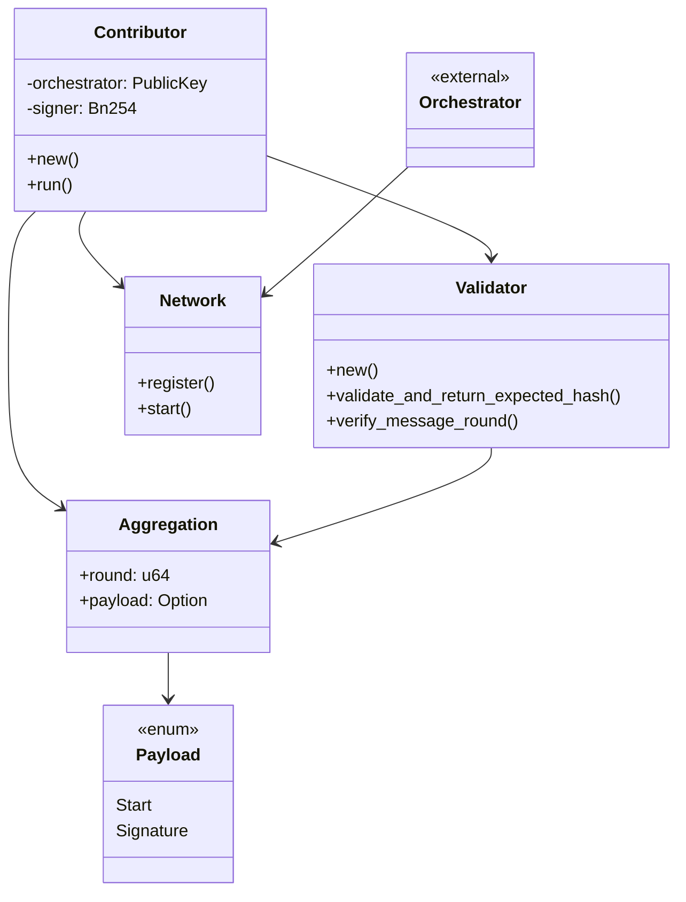
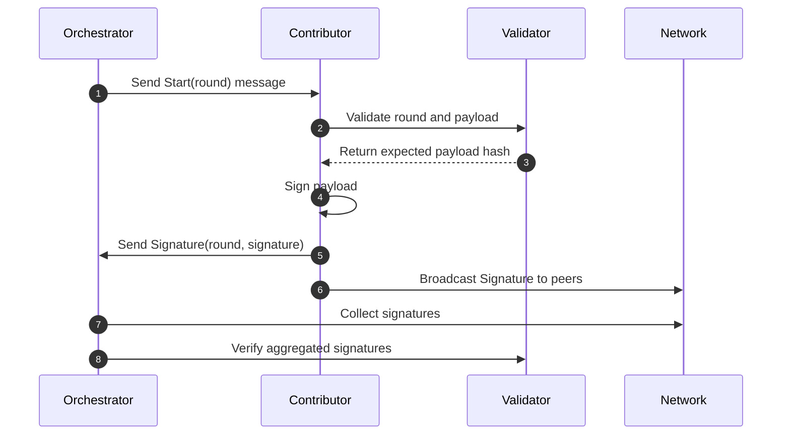

# Commonware AVS Node

[](https://www.rust-lang.org)

## Overview

A node enables operators to participate in BLS signature aggregation for AVS protocols, communicating with an orchestrator and other contributors in the network.

## Orchestrator Configuration

The orchestrator configuration file (`orchestrator.json`) specifies the connection details for the orchestrator node. The file includes:

- `g2_x1`, `g2_x2`, `g2_y1`, `g2_y2`: Public key coordinates for the orchestrator
- `address`: IP address or hostname of the orchestrator (optional, defaults to "localhost" for backwards compatibility)
- `port`: Port number for the orchestrator

Example `orchestrator.json`:
```json
{
    "g2_x1": "20265730220917057623326116620721648047640065506233168445998945605458084341755",
    "g2_x2": "1537141129484558011683382469842956131676085503509229854572844956364492197092",
    "g2_y1": "4380068110839997539835821427545270098552639074995346826656804866303457881635",
    "g2_y2": "479676018937294309080674601592141614301396550682703157902264620243097107417",
    "address": "192.168.1.100",
    "port": "3000"
}
```

For backwards compatibility, if the `address` field is omitted, it will default to "localhost".

## Running Contributors
```bash
source .env
cargo run --release -- --key-file $CONTRIBUTOR_1_KEYFILE --port 3001 --orchestrator orchestrator.json 

source .env
cargo run --release -- --key-file $CONTRIBUTOR_2_KEYFILE --port 3002 --orchestrator orchestrator.json 

source .env
cargo run --release -- --key-file $CONTRIBUTOR_3_KEYFILE --port 3003 --orchestrator orchestrator.json 
```
If you wish to run an aggregating contributor, add the option `--aggregation` argument, for example, if you want the first contributor to be aggregating,
```bash
source .env
cargo run --release -- --key-file $CONTRIBUTOR_1_KEYFILE --port 3001 --orchestrator orchestrator.json --aggregation
```

You may also use the short command `-a` in place of `--aggregation`.

---

## Core Functionalities

- **Signature Aggregation**: Aggregates signatures from multiple contributors, supporting quorum signing (e.g., n-of-m).
- **Contributor Node**: Each node signs payloads and broadcasts signatures to the orchestrator and peers.
- **Coordinate with Orchestrator**: Listen to aggregation rounds, initiate signing, and broadcast signatures.
- **Validator**: Verifies message rounds and payloads, ensuring only valid payloads are signed.
- **P2P Network**: Authenticated, message-based communication between contributors and orchestrator.
- **Wire/Codac**: Defines message formats for aggregation rounds and signatures.
- **Network lookup**: Fetches operator states from eigenlayer avs contracts for dynamic network peer configuration.

## Architecture Diagram



---

## Aggregation Workflow


